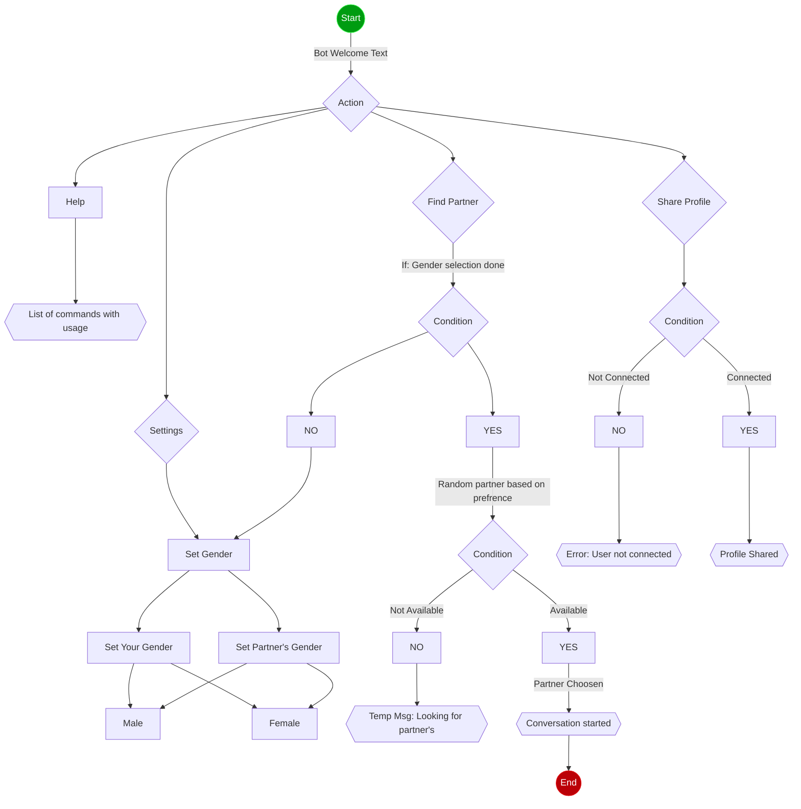

# TeleGram AnonymousChatBot

Intro
--------
This ChatBot is Telegram version of [omegle](http://www.omegle.com)

Dependancies 
-------------
In order to run this code you're supposed to have **python-telegram-bot**, **pymongo** and **pytz** libary installed
on your machine, you can just use *pip* command to this.

```bash
-> pip3 install -r requirements.txt
```

Bot WorkFlow
-----------



## Project Structure
```
|-- app.py
|-- info.py
|-- database.py
|-- readme.md
|-- requirements.txt
```

Give it a star 
--------------
Did you find this information useful, then give it a star 


Credits
-----------
All the credits to [mramitdas](https://github.com/mramitdas)
